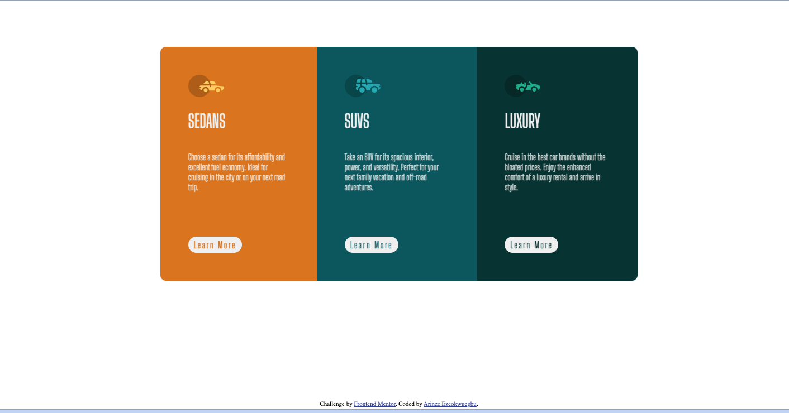

# Frontend Mentor - 3-column preview card component

## Welcome! 👋

Thanks for checking out this front-end coding challenge solution.

# Frontend Mentor - 3-column preview card component solution

This is a solution to the [3-column preview card component challenge on Frontend Mentor](https://www.frontendmentor.io/challenges/3column-preview-card-component-pH92eAR2-). Frontend Mentor challenges help you improve your coding skills by building realistic projects. 

## Table of contents
  - [The challenge](#the-challenge)
  - [Links](#links)
- [My process](#my-process)
  - [Built with](#built-with)
  - [What I learned](#what-i-learned)
  - [Continued development](#continued-development)
  - [Useful resources](#useful-resources)
- [Author](#author)

### The challenge

Users should be able to:

- View the optimal layout depending on their device's screen size
- See hover states for interactive elements

### Screenshot

### Links

## My process
- Structured the content by adding the appropriate html tags around given text in the html file.
- Styled the html file using css flexbox 
- Finally added responsiveness using css media query

### Built with
- Semantic HTML5 markup
- CSS custom properties
- Flexbox

### What I learned

CSS flexbox 

### Continued development

Responsiveness
Build using frameworks - React, Angular etc.

## Author
Arinze Darlington Ezeokwuegbu

- Frontend Mentor - [@daceze](https://www.frontendmentor.io/profile/daceze95)